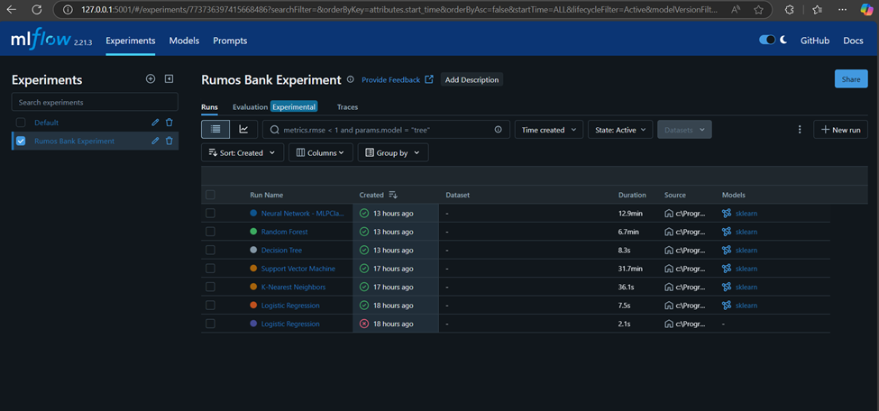
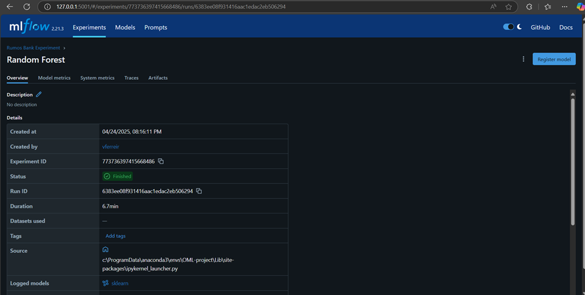
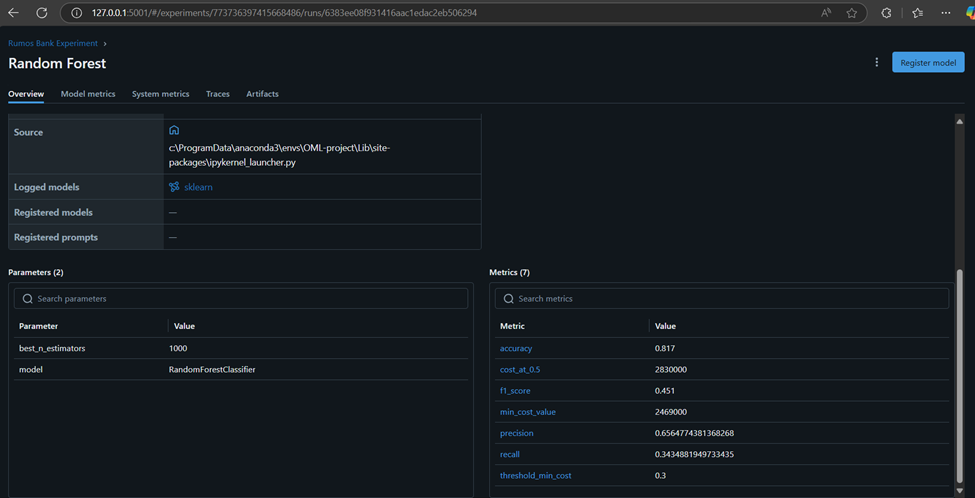
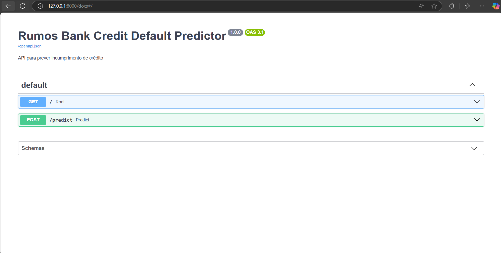
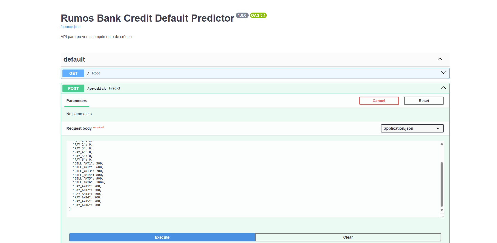
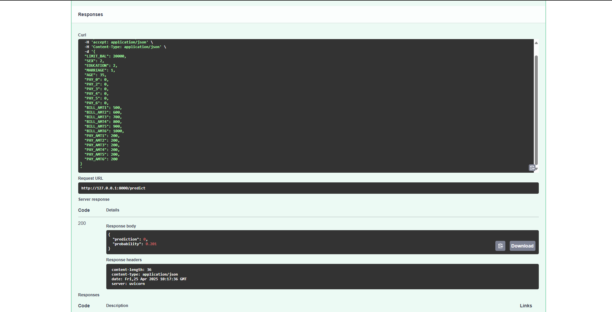

## Rumos Bank - Previsão de Incumprimento de Crédito

Este projeto foi desenvolvido no âmbito do módulo de Operacionalização de Machine Learning do curso de Pós-Graduação em Data Science.
O objetivo é prever clientes que podem incorrer em incumprimento de pagamento de crédito, garantindo uma passagem eficiente do modelo de Machine Learning para produção.

Objetivos principais:
- Construir e treinar modelos de previsão
- Trackear, comparar e registar modelos com MLflow
- Servir o melhor modelo com FastAPI
- Containerizar o serviço com Docker
- Automatizar testes com Pytest
- Preparar o ambiente para CI/CD

### Rumos Bank going live

The Rumos Bank é um banco que tem perdido bastante dinheiro devido à quantidade de créditos que fornece e que não são pagos dentro do prazo devido. 

Depois do banco te contratar, como data scientist de topo, para ajudares a prever os clientes que não irão cumprir os prazos, os resultados exploratórios iniciais são bastante promissores!

Mas o banco está algo receoso, já que teve uma má experiência anterior com uma equipa de data scientists, em que a transição dos resultados iniciais exploratórios até de facto conseguirem ter algo em produção durou cerca de 6 meses, bem acima da estimativa inicial.

Por causa desta prévia má experiência, o banco desta vez quer ter garantias que a passagem dos resultados iniciais para produção é feita de forma mais eficiente. O objetivo é que a equipa de engenharia consegue colocar o vosso modelo em produção em dias em vez de meses!

---

### COMO CORRER ESTE PROJETO

1. Clonar o repositório:
Correr os seguintes comandos no terminal:

git clone https://github.com/vbferreira/OML_final_project_clean.git
cd OML_final_project_clean

2. Criar o ambiente Conda:
conda env create -f conda.yml
conda activate OML-project

3. Abrir e correr o notebook:
Abre o ficheiro notebooks/rumos_bank_leading_prediction_final_project.ipynb num ambiente Jupyter (VS Code, Jupyter Lab ou Notebook).
Corre todas as células com o ambiente OML-project ativado.

--- 

### ESTRUTURA DO PROJETO

Pasta principal: OML_FINAL_PROJECT_CLEAN
Contém os seguintes ficheiros e pastas:

OML_final_project_clean/
├── notebooks/
│   ├── rumos_bank_lending_prediction.ipynb   ← notebook principal com treino e comparação de modelos
│   └── save_rf_model_joblib.ipynb            ← notebook auxiliar para exportar o modelo final comprimido
├── model_rf_compressed.joblib                ← modelo final Random Forest comprimido com joblib
├── Dockerfile                                ← instruções para criar o container com FastAPI
├── main.py                                   ← script principal da API FastAPI
├── test_main.py                              ← testes da API com pytest
├── conda.yml                                 ← ambiente Conda com dependências para treino e produção
├── requirements.txt                          ← bibliotecas para servir a API (FastAPI, joblib, etc.)
├── .github/workflows/                        ← pipeline de CI/CD com GitHub Actions
├── app/                                      ← estrutura da API 
├── images/                                   ← imagens do MLflow e prints do projeto (para README)
├── mlruns/                                   ← artefactos gerados pelo MLflow.O .pkl original foi removido devido O modelo final está disponível como .joblib (ver notas)
├── tests/                                    ← testes automatizados da API
├── data/                                     ← dados (`lending_data.csv`)
└── README.md                                 ← este ficheiro

---

### MLflow: TRACKING DE MODELOS 

Todos os modelos foram treinados com GridSearchCV e as runs foram trackeadas com MLflow localmente. Cada modelo foi testado com vários hiperparâmetros e as métricas foram registadas para comparação.

Modelos incluídos:

Logistic Regression

K-Nearest Neighbors

Decision Tree

Random Forest

Support Vector Machine

Neural Network (MLPClassifier)

Abaixo estão incluídos prints do MLflow UI:

Lista de todas as runs:

Detalhes das métricas da melhor run (Random Forest):

O modelo com melhor desempenho em termos de custo total e F1-score foi o Random Forest, que foi posteriormente registado no MLflow Model Registry com o nome RumosBankFinalModel.

---

### FastAPI: SERVIÇO DE PREVISÃO 

A API foi desenvolvida com FastAPI e serve o modelo registado no MLflow. Está disponível em `http://127.0.0.1:8000/docs` com interface interativa.

Interface Swagger UI:

Exemplo de previsão realizada:

---

### TESTES AUTOMATIZADOS DA API

Foram desenvolvidos testes com pytest para garantir que a API responde corretamente e faz previsões com base no modelo registado. Os testes encontram-se no ficheiro tests/test_api.py e incluem:
    - Teste de validação de input válido
    - Teste de resposta da previsão com estrutura esperada

Para correr os testes
- No treminal:
set PYTHONPATH=.
pytest tests/test_api.py

Exemplo de output:
tests/test_api.py ..     [100%]

Os testes passaram com sucesso. Foram também levantados warnings relacionados com a nova versão do Pydantic, que não comprometem o funcionamento.

---

## Observações Finais

Os artefactos gerados pelo MLflow para todos os modelos, exceto o modelo final Random Forest, foram removidos da pasta `mlruns/`, devido às limitações de espaço impostas pelo GitHub.

O modelo original (`model.pkl`) criado pelo MLflow tinha mais de 100 MB, ultrapassando o limite permitido, mesmo com Git LFS. Para contornar essa limitação, o modelo foi exportado e comprimido como `model_rf_compressed.joblib`.

Devido a essas restrições de tamanho, o ficheiro `model_rf_compressed.joblib` **não está incluído neste repositório**, mas pode ser descarregado aqui:

📥 [Download via Google Drive](https://drive.google.com/uc?id=11P1Jt12AXi8vWVOLnOjnGGLJaoEO_MrF)

Após o download, o ficheiro deve ser colocado na **pasta raiz do projeto**, ou seja, no mesmo nível que `main.py` e `Dockerfile`.

Este modelo é necessário para:
- Servir a API com FastAPI
- Correr os testes automatizados
- Reproduzir previsões localmente

---

## Notas sobre os testes automáticos (CI/CD)

O projeto inclui testes automatizados com `pytest` que validam a resposta da API. Estes testes funcionam corretamente em ambiente local, desde que o modelo `.joblib` esteja presente.

No entanto, como os testes no GitHub Actions **não conseguem aceder ao modelo via Google Drive**, ocorre uma falha ao tentar carregar o ficheiro ausente.

Isto não compromete o funcionamento do projeto em ambiente local ou real — apenas indica que os testes automáticos no CI/CD requerem a presença manual do modelo.

---

